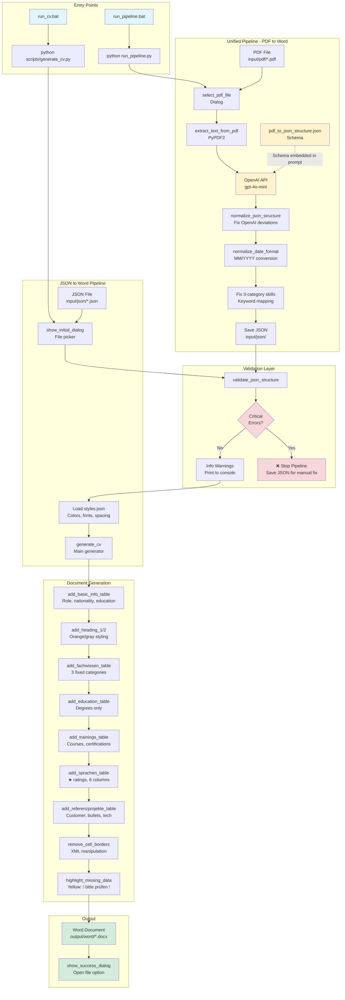

# CV Generator Architecture

## System Overview

The CV Generator provides two distinct pipelines for creating professional CV documents:

1. **Unified Pipeline**: Converts PDF CVs to Word documents via intelligent OpenAI extraction
2. **Direct Pipeline**: Converts pre-existing JSON files directly to Word documents

Both pipelines converge at the validation and document generation stages, ensuring consistent output quality.

---

## Flow Diagram



---

## Pipeline Details

### 🔵 Unified Pipeline (PDF → JSON → Word)

**Entry**: `run_pipeline.bat` or `python run_pipeline.py [pdf_path]`

**Process**:
1. **PDF Extraction**: PyPDF2 extracts raw text from all pages
2. **OpenAI API Call**: Sends extracted text + JSON schema to GPT model
3. **Normalization**: Corrects common OpenAI structural deviations:
   - Fixes nested `Expertise` wrapper → flat `Fachwissen_und_Schwerpunkte`
   - Renames `BulletList` → `Inhalt`
   - Maps arbitrary skill categories → 3 fixed categories (Projektmethodik, Tech Stack, Weitere Fähigkeiten)
   - Converts all dates to `MM/YYYY` format
4. **JSON Saved**: `input/json/{Vorname}_{Nachname}_{timestamp}.json`
5. **Continues to validation** → Word generation

**Key Files**:
- `run_pipeline.py`: Orchestration logic
- `scripts/pdf_to_json.py`: Extraction + OpenAI integration
- `scripts/pdf_to_json_structure.json`: Schema contract

### 🔵 Direct Pipeline (JSON → Word)

**Entry**: `run_cv.bat` or `python scripts/generate_cv.py`

**Process**:
1. **File Selection**: Dialog to pick JSON from `input/json/`
2. **Continues to validation** → Word generation

**Use Cases**:
- Manual JSON creation
- Editing failed extractions
- Batch processing pre-existing JSONs

---

## Validation Layer

**Function**: `validate_json_structure(data)` returns `(critical, info)`

### Critical Errors (Blocks Generation)
- Missing required fields
- Wrong data types (e.g., array instead of object)
- Invalid structure (e.g., missing `Titel`/`Beschreibung` in `Hauptrolle`)

### Info Warnings (Allows Generation)
- Suboptimal field lengths (e.g., role description not 5-10 words)
- Invalid language levels
- Missing optional fields

**On Failure**: JSON is saved for manual correction, user notified to fix and rerun with `run_cv.bat`

---

## Document Generation

### Key Patterns

1. **Borderless Tables**: All sections use tables for layout control
   - Column widths in Inches (e.g., `Inches(1.5)`, `Inches(5.5)`)
   - Borders removed via XML manipulation (`remove_cell_borders()`)

2. **Styling System**: `styles.json` defines:
   - `heading1`: Orange, 16pt, bold (section headers)
   - `heading2`: Gray, 11pt, bold (subsection headers)
   - `text`: Black, 11pt (body content)
   - `bullet`: Orange square (■), hanging indent

3. **Missing Data Handling**:
   - Marker variants normalized to `"! bitte prüfen !"`
   - All instances highlighted yellow in final document

4. **Language Stars**: Levels 1-5 mapped to text + star ratings
   - Sorted descending by level before display

### Generation Sequence

1. Basic Info Table (role, nationality, education)
2. Kurzprofil (profile summary)
3. Fachwissen (3 fixed skill categories)
4. Education (academic degrees only)
5. Trainings (courses, certifications)
6. Languages (with star ratings)
7. Reference Projects (customer, activities, tech, methodology)

---

## File Organization

```
cv_generator/
├── run_pipeline.py          # Unified pipeline orchestrator
├── run_pipeline.bat         # Windows launcher (unified)
├── run_cv.bat               # Windows launcher (direct)
├── scripts/
│   ├── pdf_to_json.py       # PDF extraction + OpenAI
│   ├── generate_cv.py       # JSON → Word converter
│   ├── pdf_to_json_structure.json  # Schema contract
│   └── styles.json          # Visual styling
├── input/
│   ├── pdf/                 # Source PDFs
│   └── json/                # Extracted/manual JSONs
└── output/
    └── word/                # Generated CVs
```

---

## External Dependencies

- **OpenAI API**: GPT-4o-mini for intelligent PDF extraction
  - Requires `.env` file with `OPENAI_API_KEY`
  - Schema-driven prompting ensures structured output
  - Temperature=0 for consistency

- **python-docx**: Word document manipulation
  - Direct XML access for border removal
  - Fine-grained paragraph/run formatting

- **PyPDF2**: PDF text extraction
  - Page-by-page processing
  - Fallback error handling

---

## Design Decisions

### Why Two Pipelines?
- **Unified**: Ideal for quick CV updates from candidate PDFs
- **Direct**: Allows manual quality control and custom JSON creation

### Why OpenAI API?
- Handles messy PDF layouts intelligently
- Understands semantic meaning (e.g., "Education" vs "Training")
- Adapts to varying CV formats without brittle regex parsing

### Why Fixed 3-Category Skills?
- Consistent presentation across all CVs
- Client requirement for standardized format
- Keyword mapping handles OpenAI's category variations

### Why Save JSON Intermediate?
- Debugging: inspect what OpenAI extracted
- Quality control: manual fixes before Word generation
- Reusability: generate Word multiple times from same JSON
- Archival: structured data for future processing

---

## See Also

- [SETUP.md](SETUP.md) - Installation and first-time setup
- [.github/copilot-instructions.md](.github/copilot-instructions.md) - Development patterns and conventions
